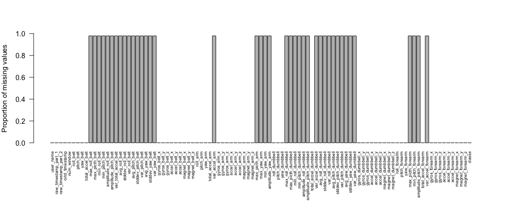
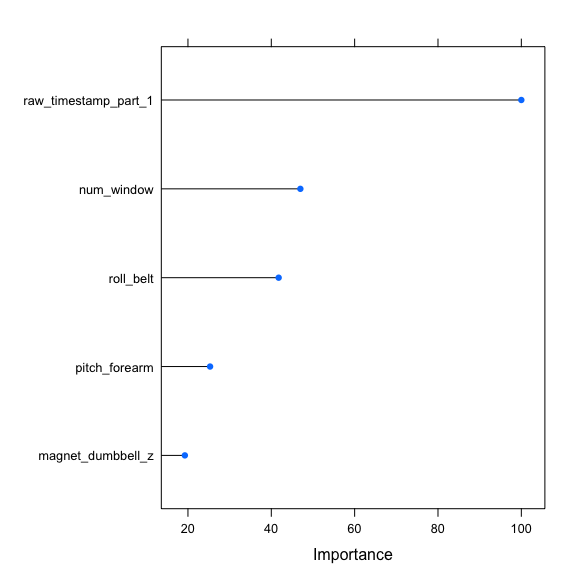

# Classifying subjects based on personal activity profiles
Gavin Douglas  
July 15, 2016  

The belows commands were used to complete the final Prediction assignment for the Coursera course "Practical Machine Learning". This assignment focused on classifying 1000s of observations of over 100 measures of personal activity. Specifically, the data is from accelerometers on the belt, forearm, arm and dumbell of 6 people who performed barbell lifts correctly and incorrectly in 5 different ways (the "classe" variable below). 

I first filtered out features that were not very variable and/or had mainly missing data. I then split the dataset into training and test sets (note both of these sets are subsets from the "pm-training.csv" data) . I trained a random forest model to predict the "classe" variable (either A, B, C, D or E) on the training set and got an estimate of the out-of-sample accuracy of 99.96% on the test set. 

After establishing that the out-of-sample accuracy is very low, I predicted the "classe" variable in a separate dataset where this variable was not provided. I was able to successfully predict the "classe" variable correctly every time.

## Pre-processing

I first loaded in the required packages (doMC is required for multi-threading, which was done over 4 cores in this case).

```r
library("caret")
```

```
## Loading required package: lattice
```

```
## Loading required package: ggplot2
```

```r
library(doMC)
```

```
## Loading required package: foreach
```

```
## Loading required package: iterators
```

```
## Loading required package: parallel
```

```r
registerDoMC(cores = 4)
```
  
I next read in the 2 datasets provided. Note that you need to set your working directory to where these files are with "setwd". I removed features that varied little across observations.  

```r
train <- read.csv("pml-training.csv" , header=T, row.names=1 )
unknown <- read.csv("pml-testing.csv", header=T, row.names=1 )

low_variance_col <- nearZeroVar( train )

train <- train[ , -low_variance_col]
```
  
The above removed 60 columns that had little or no variance (default of nearZeroVar function). I then determined how missing values are distributed across the different features:


```r
par(mar=c(8, 4, 4, 2)) # changed margins to show x-axis labels

col_na_prop <- apply( train , 2 , function(x) { sum(is.na(x)) / length(x) } )

barplot ( col_na_prop , ylab="Proportion of missing values" , las=2, cex.names=0.6, ylim=c(0,1) )
```

<!-- -->

```r
par(mar=c(5.1, 4.1, 4.1 , 2.1)) # reset default margins
```
   
Since features tend to have either 0 or ~95% of missing values, I decided to throw out all 41 features which had any missing values. I also did this for the "unknown" dataset to ensure that the same features were being preserved.  
  

```r
train <- train[ , names( which( col_na_prop == 0 ) ) ]
col2keep <- colnames(train[ , -ncol(train)])
unknown <- unknown[ , col2keep ]
```
   
## Fitting random forest    
     
I next split the data into the test (25%) and training (75%) sets, set a random seed for reproducibility and fit a random forest model on the training data.  
  
I used 5-fold cross-validation when training the model, which in a grid search (with a tune-length of 10) could identify which "mtry" parameter (the number of features randomly sampled at each node in the tree) resulted in the highest accuracy.   
  

```r
inTrain = createDataPartition(train$classe, p = 3/4)[[1]]

test <- train[-inTrain,]
train <- train[inTrain , ]

set.seed( 4194 )

fit_control <- trainControl( method = "cv", number = 5, search="grid") 
rf_mod <- train( classe ~ . , data=train , method="rf", trControl=fit_control , ntree=500, tuneLength=10 )
```
  
These are the top 5 most important features for the model:


```r
plot( varImp(rf_mod) , 5)
```

<!-- -->

## Out-of-sample accuracy/error    
  
To get an estimate of the out-of-sample accuracy (which is the complement of the error), I compared what "classe" variables I predicted with this model on the test set defined above compared to the actual value in that dataset:


```r
rf_mod_predict <- predict( rf_mod , test )

rf_mod_predict_outcome <- confusionMatrix( rf_mod_predict , test$classe )

print(rf_mod_predict_outcome)
```

```
## Confusion Matrix and Statistics
## 
##           Reference
## Prediction    A    B    C    D    E
##          A 1395    0    0    0    0
##          B    0  949    0    0    0
##          C    0    0  855    0    0
##          D    0    0    0  804    1
##          E    0    0    0    0  900
## 
## Overall Statistics
##                                      
##                Accuracy : 0.9998     
##                  95% CI : (0.9989, 1)
##     No Information Rate : 0.2845     
##     P-Value [Acc > NIR] : < 2.2e-16  
##                                      
##                   Kappa : 0.9997     
##  Mcnemar's Test P-Value : NA         
## 
## Statistics by Class:
## 
##                      Class: A Class: B Class: C Class: D Class: E
## Sensitivity            1.0000   1.0000   1.0000   1.0000   0.9989
## Specificity            1.0000   1.0000   1.0000   0.9998   1.0000
## Pos Pred Value         1.0000   1.0000   1.0000   0.9988   1.0000
## Neg Pred Value         1.0000   1.0000   1.0000   1.0000   0.9998
## Prevalence             0.2845   0.1935   0.1743   0.1639   0.1837
## Detection Rate         0.2845   0.1935   0.1743   0.1639   0.1835
## Detection Prevalence   0.2845   0.1935   0.1743   0.1642   0.1835
## Balanced Accuracy      1.0000   1.0000   1.0000   0.9999   0.9994
```
  
The overall out-of-bag accuracy is 0.9997961 with 95% confidence intervals of 0.9988644 to 0.9999948. Therefore, the error rate is << 1% and should be sufficient to predict the "classe" values in the "unknown" dataset.  
  
## Predicting unknown "classe" values  
       
The predictions based on this command were all correct (based on online quiz):
     

```r
unknown_predict <- as.character( predict ( rf_mod , unknown ) )
```
  
